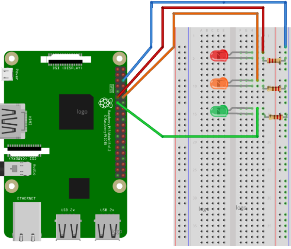

# WindowsIotTrafficLights
Traffic lights simulator built on Windows 10 IoT Core and Raspberry Pi.

## Electronic components
This is all you need to get things done on hardware size:

* Raspberry Pi
* Cheap breadboard
* Red, yellow and green LED
* Three resistors (I have 270Ω)
* Jumper wires for cabling

If you are not electronics guy then I suggest you to ask correct resistors for LED-s you are buying from electronics shop.

## Wiring
Wiring is simple using breadboard. Just connect everything you have like shown on the following diagram.

## Architecture of solution
The solution is made of three projects:

* WindowsIotTrafficLights - interfaces and their default implementations.
* WindowsIotTrafficLightsApp - UWP traffic lights app for Raspberry, has UI with traffic lights.
* WindowsIotTrafficLightsService - traffic lights implemented as Windows 10 IoT Core background task.

The core of traffic lights is shown on the following diagram.

Interfaces:

* IScheduleUpdateClient - used for LED-s schedule updates.
* ISwitcher - used to show traffic lights (be it LED-s or something else).

Classes:

* WebScheduleUpdateClient - schedule updater that requests data from web address.
* LightsManager - turns traffic lights on and off based on schedule.
* Schedule - DTO class for schedule.
* ScheduleItem - DTO class for schedule item.
* LedSwitcher - ISwitcher implementation for LED-s connected to Raspberry Pi.
* FromSwitcher - ISwitcher to bling traffic lights shapes on XAML form.
